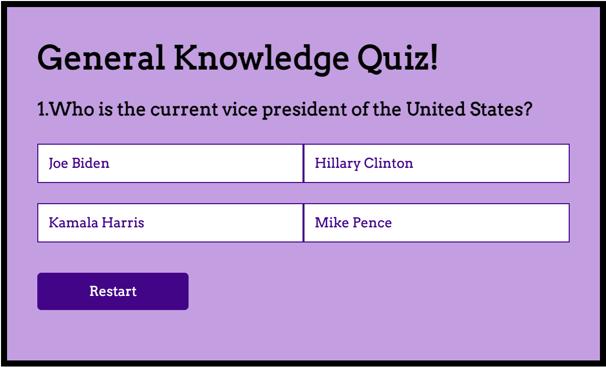

# General Knowledge Quiz

Users who like to challenge themselves on broad themes are the target audience for this website. Users can assess their level of knowledge about the world in general by answering a variety of questions that are related to seemingly random themes. It is a good way for them to learn something new and intriguing while also refreshing their memories.

[View my live project here!](https://dinakidane.github.io/js-quiz/)

## Features

### Existing Features

- __The Heading__
  
    - The 'General Knowledge Quiz' heading has been prominently displayed at the top of the box, making it easily visible to users. 
    - The heading stays bold and consistent on every page, allowing it to grab the user's attention.
  
    - 

- __The Instructions__

    - The purpose for this section allows every user to understand how to navigate through the game which allows the process of the game to be much easier, quicker and more enjoyable for the user to play

    - 

- __Game Area__

    - This section will contain the question below the main heading. 
    - The section below the questions will contain 4 different answers, and the user is able to click an option that they think is the correct answer.
    - If their answer is correct, it'll come up green.
    - If their answer is incorrect, it'll come up red and simultaneously, the correct answer will come up green.

    - 

- __Score Area__

    - This section enables the user to see how many answers they got correct out of 10, which is the number of questions that was asked.
    - Following the score reveal, a message is also revealed to the user depending on the score that they get

    - 