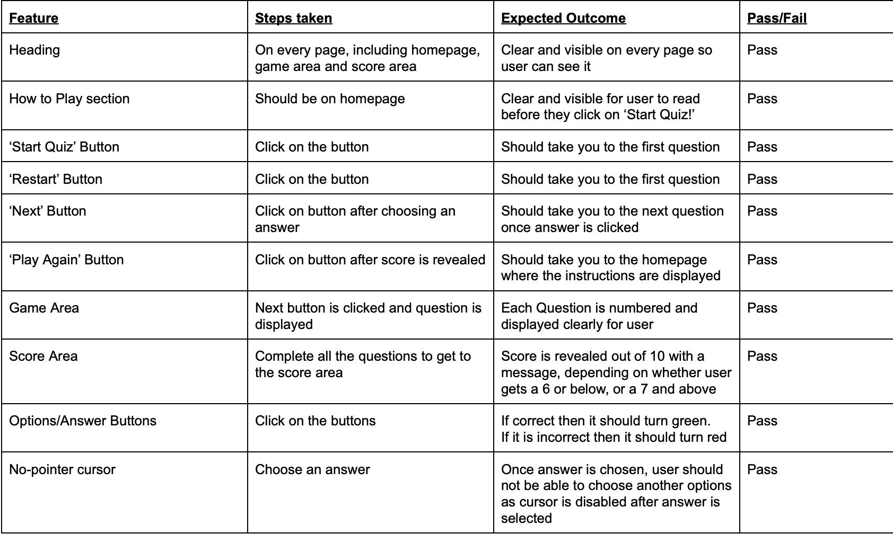

# General Knowledge Quiz

Users who like to challenge themselves on broad themes are the target audience for this website. Users can assess their level of knowledge about the world in general by answering a variety of questions that are related to seemingly random themes. It is a good way for them to learn something new and intriguing while also refreshing their memories.

[View my live project here!](https://dinakidane.github.io/js-quiz/)

## Features

### Existing Features

- __The Heading__
  
    - The 'General Knowledge Quiz' heading has been prominently displayed at the top of the box, making it easily visible to users. 
    - The heading stays bold and consistent on every page, allowing it to grab the user's attention.
  
    - 

- __The Instructions__

    - The purpose for this section allows every user to understand how to navigate through the game which allows the process of the game to be much easier, quicker and more enjoyable for the user to play

    - 

- __Game Area__

    - This section will contain the question below the main heading. 
    - The section below the questions will contain 4 different answers, and the user is able to click an option that they think is the correct answer.
    - If their answer is correct, it'll come up green.
    - If their answer is incorrect, it'll come up red and simultaneously, the correct answer will come up green.

    - 

- __Score Area__

    - This section enables the user to see how many answers they got correct out of 10, which is the number of questions that was asked.
    - Following the score reveal, a message is also revealed to the user depending on the score that they get

    - 

### Features left to implement

- Potentially, including a timer element on every question could have made answering the question within the allotted time more challenging and perhaps even more enjoyable for the user.

## Testing

### Validator Testing

- [Testing for HTML](https://validator.w3.org/#validate_by_input)
  
  - No errors were detected
  - 

- [Testing for CSS](https://jigsaw.w3.org/css-validator/#validate_by_input)

  - No errors were detected
  - 

- [Testing for Javascript](https://jshint.com/)

  - No errors were found when passing through the official Jshint validator
  - The metrics:
    - There are 12 functions in this file.
    - Function with the largest signature take 1 arguments, while the median is 0.
    - Largest function has 8 statements in it, while the median is 4.
    - The most complex function has a cyclomatic complexity value of 3 while the median is 2

- Browser Compatibility

  - Tested on:
    - Google Chrome on macOS 110.0.5481.177
    - Safari on macOS X 10.11 El Capitan
    - Microsoft Edge Version 110.0. 1587.41

- Functionality Testing

    - 

- Bugs

## Design

### Colour Scheme

- The colour scheme was motivated by the intention to make sure the quiz delivers a fun and playful feel towards the user.
- The contrasts between the light and dark purple is used to display a consistent theme throughout every page. 
- While presenting a minimalistic and straightforward layout, the white background draws the user's attention to the Quiz box area.
- The heading and the question are black and bold, distinguishing it from the rest of the text to indicate they are headings of the text below.
- 

### Typography

- Using the Arvo font style throughout the game was intentional to ensure a modern feel was emphasised throughout the website.
- The Arvo font also allowed a clear read for the reader, whilst maintaing a minimilist feel. 

### Wireframes

- Desktop
   
    - 

- Tablet
    
    - 

- Smartphone
   
    - 

## Technologies Used

### Languages Used

- HTML
- CSS
- Javascript

### Frameworks, Libraries & Programs Used

## Deployment

### How the site was deployed

### How the repository was cloned

## Credits

### Content

### Code

## Acknowledgements